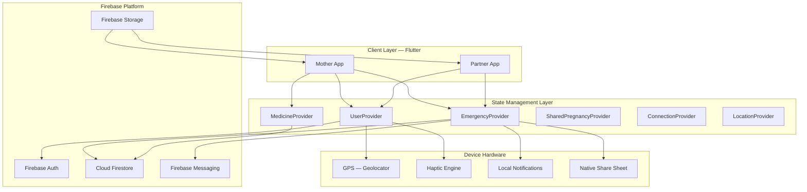
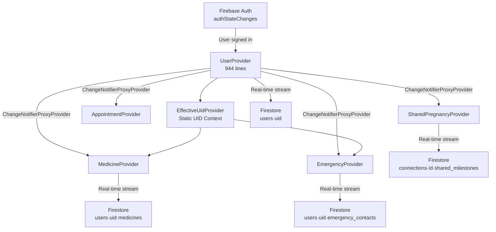
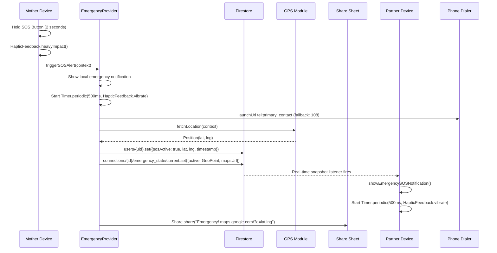
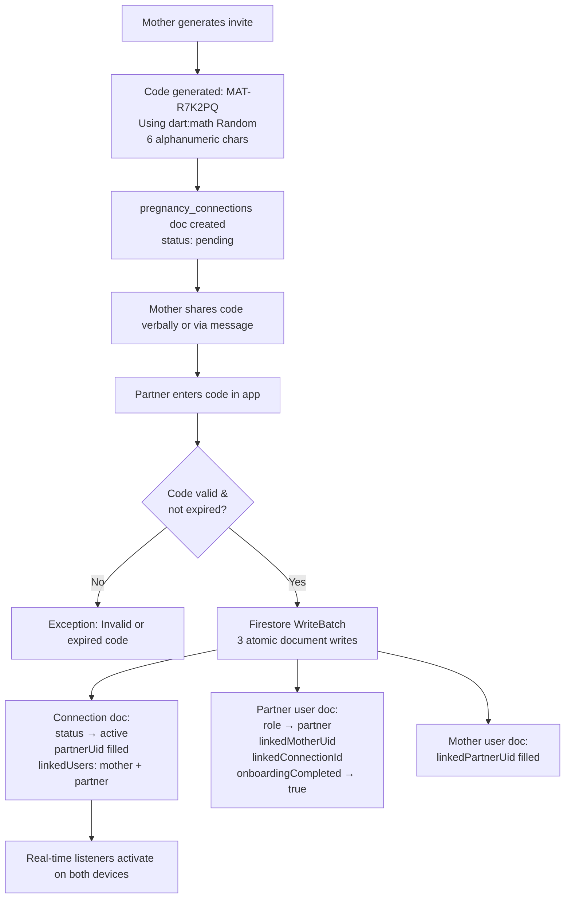
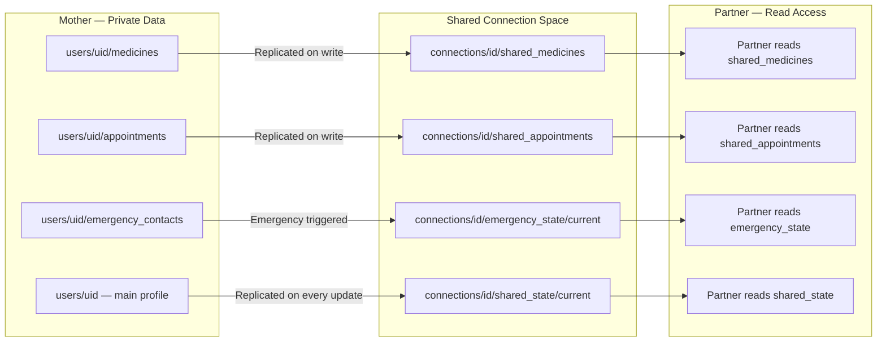
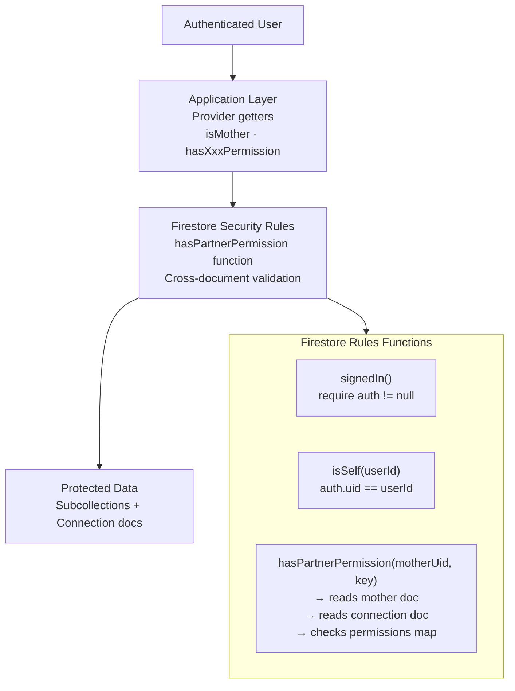
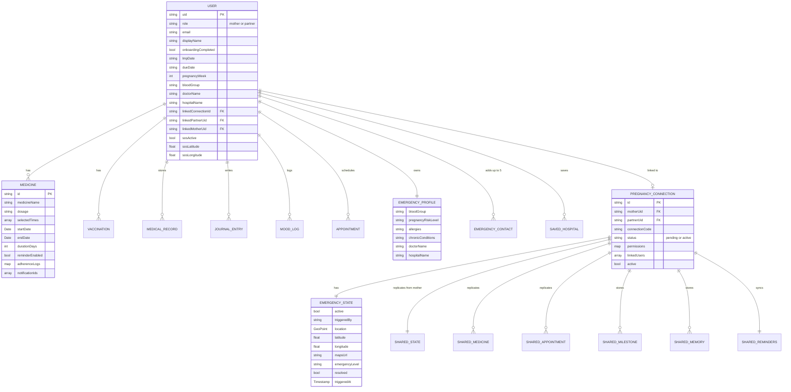
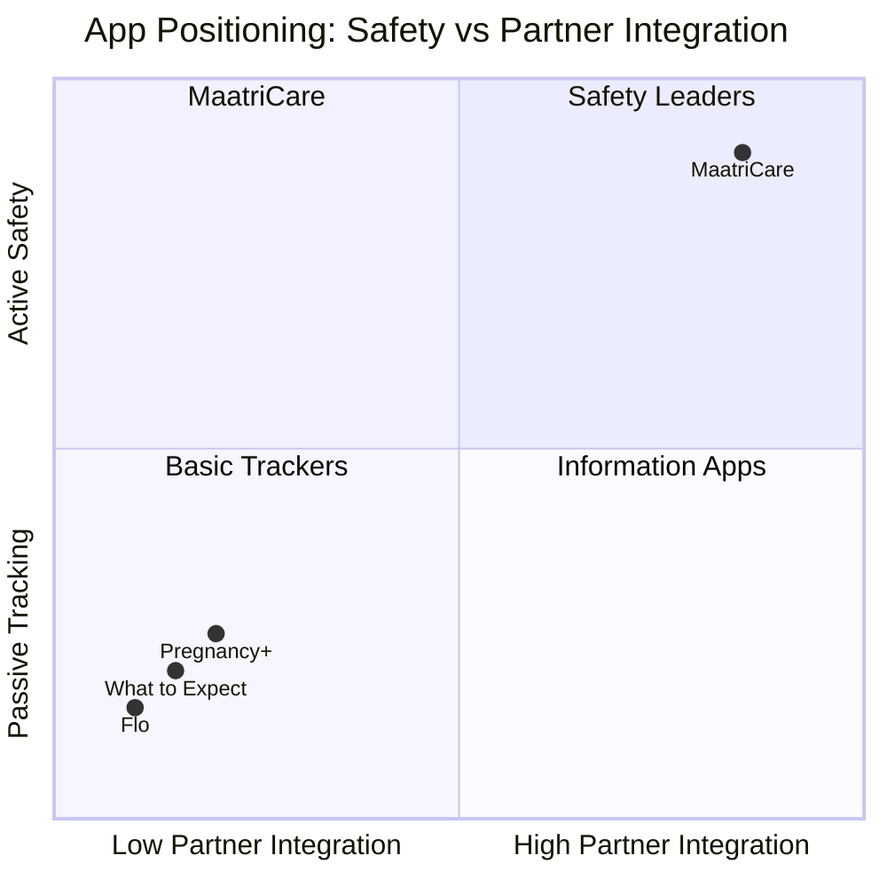
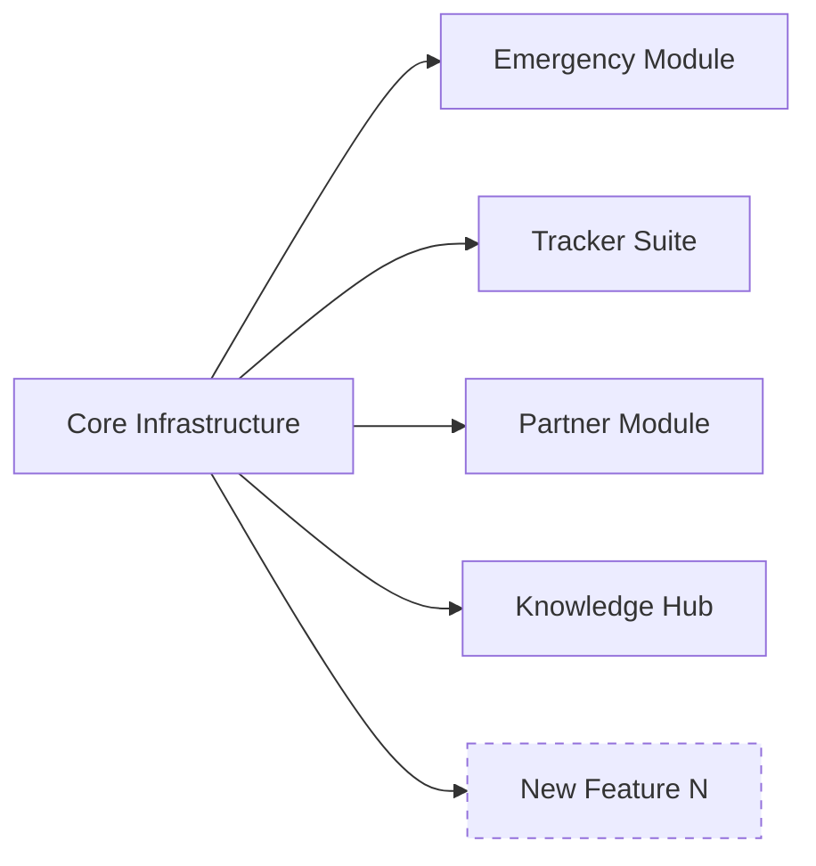

<div align="center">

---

# 🌸 MaatriCare

## *Transforming Pregnancy Tracking into Maternal Safety and Partner-Assisted Healthcare*

<br/>

| | |
|---|---|
| **Team Name** | Tup-Varan-Bhat |
| **Members** | Kapil Joshi · Ojas Joshi · Aditya Dhule |
| **Institution** | Vishwakarma Institute of Technology (VIT), Pune |
| **Platform** | Flutter (Android · iOS · Web) |
| **Backend** | Firebase (Auth · Firestore · Storage · Messaging) |

<br/>

> *"When a pregnant woman is in danger, getting help requires too many steps — MaatriCare reduces it to one gesture."*

---

</div>

<br/>

---

## Table of Contents

1. Executive Summary
2. Problem Statement
3. Existing Solution Gaps
4. Our Solution
5. Key Innovations
6. Unique Selling Proposition
7. System Architecture
8. Emergency Response Architecture
9. Partner Synchronization Architecture
10. Security Architecture
11. Technical Stack
12. Database Design
13. Feature Breakdown
14. Competitive Analysis
15. Scalability Analysis
16. Impact Analysis
17. Why This Matters
18. Future Roadmap
19. Conclusion

---

<br/>

## 1. Executive Summary

Maternal healthcare in India and globally is fragmented, reactive, and often partner-agnostic. Expectant mothers navigate a disconnected landscape of clinical portals, paper records, messaging threads, and standalone apps — none of which communicate with each other, and none of which provide real-time emergency capabilities.

**MaatriCare** reframes the problem entirely.

Rather than building another pregnancy tracker, we built a **maternal safety and partner-assisted healthcare ecosystem**. The core philosophy is simple: pregnancy is not a solo journey, and healthcare should not be either. MaatriCare connects the mother and her partner on a live, permission-controlled shared platform — where health data is synchronized in real time, where a single gesture triggers a complete emergency response, and where critical medical information remains accessible even without an internet connection.

### What We Built

| Pillar | Implementation |
|---|---|
| **Emergency Preparedness** | 2-second gesture-hold SOS → auto-dial + GPS share + partner haptic alarm + Firestore sync |
| **Partner Integration** | 9-permission real-time role system, enforced at app and database layer |
| **Health Tracking** | Vitals, medications, baby monitoring, contractions, kick logs, emotional wellness |
| **Offline Safety Net** | Emergency contacts, medical info, and paramedic card cached locally at all times |
| **Medical Documentation** | Secure cloud vault for lab reports, scans, and prescriptions |

MaatriCare does not just track pregnancy. It **protects it**.

---

<br/>

## 2. Problem Statement

### 2.1 The Maternal Healthcare Crisis

Pregnancy represents one of the most medically intensive periods in a person's life — yet the tools available to support it remain primitive, isolated, and ill-equipped for real emergencies.

#### The Four Core Failures

**① Fragmented Information**

A pregnant woman's health data is scattered across: her OB-GYN's portal, a lab report WhatsApp message, handwritten prescription notes, a general-purpose period tracker, and memory. When an emergency strikes, none of this is accessible in one place.

**② Delayed Emergency Response**

In a medical emergency, a pregnant woman must: unlock her phone, find the contact, dial, explain her location, and then separately inform someone about her medical history. Every second of delay matters. There is no app today that compresses this into a single, deliberate gesture.

**③ Partner Exclusion**

Partners are stakeholders in pregnancy — yet every mainstream pregnancy app treats them as spectators. They have no real-time visibility into the mother's medications, appointments, or distress. They receive no alert if the mother triggers an emergency.

**④ No Clinical Safety Net**

Beyond sharing a due date and baby size, no major consumer app provides a structured medical emergency profile — blood group, allergies, chronic conditions, preferred hospital, and OB-GYN — accessible to paramedics in seconds.

### 2.2 Real-World Impact

> According to WHO, India accounts for approximately **11% of global maternal deaths**. A significant proportion of these are avoidable with timely intervention and better information access at the point of care.

The technology gap is not in diagnosis — it is in **readiness, response, and communication**.

---

<br/>

## 3. Existing Solution Gaps

| Challenge | Flo | What to Expect | Pregnancy+ | MaatriCare |
|---|---|---|---|---|
| Emergency SOS with auto-dial | ❌ | ❌ | ❌ | ✅ |
| Cross-device partner alert (haptic) | ❌ | ❌ | ❌ | ✅ |
| Offline emergency data access | ❌ | ❌ | ❌ | ✅ |
| Live GPS location sharing in emergency | ❌ | ❌ | ❌ | ✅ |
| Paramedic-facing medical card | ❌ | ❌ | ❌ | ✅ |
| Real-time partner data sync | ❌ | ❌ | ❌ | ✅ |
| Granular partner permissions | ❌ | ❌ | ❌ | ✅ |
| Per-dose medication adherence | ❌ | ❌ | Limited | ✅ |
| Medical document vault | ❌ | ❌ | ❌ | ✅ |
| Week-by-week fetal development (offline) | ✅ | ✅ | ✅ | ✅ |

> **The gap is clear:** existing solutions are information tools. MaatriCare is an **action platform**.

---

<br/>

## 4. Our Solution

### MaatriCare: A Maternal Safety and Partner-Assisted Healthcare Ecosystem

MaatriCare is built on three foundational pillars:

```
┌──────────────────────────────────────────────────────────┐
│                                                          │
│   PILLAR 1: EMERGENCY READINESS                         │
│   One gesture. Multi-device response. Offline-capable.  │
│                                                          │
│   PILLAR 2: PARTNER INTEGRATION                         │
│   Real-time shared journey. Granular permissions.       │
│   Haptic alerts. Synchronized reminders.                │
│                                                          │
│   PILLAR 3: UNIFIED HEALTH TRACKING                     │
│   Vitals. Medications. Records. Emotions. Timeline.     │
│                                                          │
└──────────────────────────────────────────────────────────┘
```

### What Makes It Different

MaatriCare is **not** a tracker with a safety button bolted on. Every feature — from medication reminders to shared memories — is designed within a framework where emergency readiness, partner visibility, and medical documentation coexist in a single coherent experience.

The platform operates with **two user roles**:

| Role | Access Level | Data Scope |
|---|---|---|
| **Mother** | Full read/write | Own health data, emergency setup, document vault |
| **Partner** | Read-only, permission-gated | Sees only what mother explicitly enables |

This role model is enforced at **both the application layer and the Firestore database rules layer** — ensuring that no partner can read data they have not been granted access to, even if they bypass the UI.

---

<br/>

## 5. Key Innovations

---

### 🚨 Innovation 1: Cross-Device Emergency Alert System

**Problem Solved:** In a medical emergency, a pregnant woman may be alone, disoriented, or physically unable to navigate multiple app screens.

**Implementation:**

A persistent floating SOS button exists on every screen of the app. It requires a deliberate **2-second hold** to activate — preventing accidental triggers while keeping emergency response one gesture away.

When activated, the system executes a 5-step sequential pipeline:

```
Step 1 → Push high-priority emergency notification (local + FCM)
Step 2 → Start continuous haptic vibration loop (500ms intervals)
Step 3 → Auto-dial primary emergency contact (fallback: 108 Ambulance)
Step 4 → Fetch GPS coordinates → write to Firestore user doc + connection doc
Step 5 → Share live Google Maps link via native share sheet
```

Simultaneously, the **partner's device** receives:
- A high-priority push notification
- A continuous `HapticFeedback.vibrate()` loop driven by a `Timer.periodic(500ms)` Firestore real-time listener

**User Impact:** A single deliberate gesture triggers a multi-device, multi-channel emergency response — no navigation, no typing.

---

### 📡 Innovation 2: Offline Emergency Readiness

**Problem Solved:** Emergencies often occur in areas with poor connectivity. An app that requires internet to show emergency contacts is not a safety tool.

**Implementation:**

`EmergencyProvider` implements a cache-first architecture using `SharedPreferences`:

- On every successful Firestore sync, emergency contacts, medical info, saved hospitals, and last-known SOS state are serialized as JSON and stored locally.
- On initialization, cached data is loaded **before** any network request.
- The emergency screen is fully functional with cached data even when offline.

**User Impact:** Emergency information — including blood group, allergies, primary doctor, and contacts — is always available, regardless of connectivity.

---

### 👥 Innovation 3: Partner-Assisted Care Architecture

**Problem Solved:** Partners want to participate in the pregnancy journey but have no structured, permission-controlled access to health data.

**Implementation:**

The partner pairing system uses an invite code (`MAT-XXXXXX` format, 6 alphanumeric characters) generated by the mother. When the partner joins, a `pregnancy_connections` Firestore document is created with a granular `permissions` map:

```
permissions: {
  viewTracker: true/false,
  viewEmergency: true/false,
  medicines: true/false,
  appointments: true/false,
  babyUpdates: true/false,
  emergencyAlerts: true/false,
  reminders: true/false,
  viewNotifications: true/false,
  viewReminders: true/false
}
```

Each permission gates access in two places:
1. **Application layer:** Provider getters check `isMother` first, then the permissions map.
2. **Database layer:** Firestore rules use a `hasPartnerPermission(motherUid, key)` helper that performs a cross-document read to validate permission before any data access.

**User Impact:** Mother has complete control. Partner sees only what is explicitly shared.

---

### 🏥 Innovation 4: Paramedic Medical Emergency Card

**Problem Solved:** In a critical emergency, bystanders and first responders need immediate access to medical information without navigating through an app.

**Implementation:**

When the SOS alarm is active, a full-screen `EmergencyOverlay` widget replaces the entire application UI. It displays:

| Field | Source |
|---|---|
| Blood Group | `medical_emergency_info/profile.bloodGroup` |
| Pregnancy Risk Level | `medical_emergency_info/profile.pregnancyRiskLevel` |
| Known Allergies | `medical_emergency_info/profile.allergies` |
| Chronic Conditions | `medical_emergency_info/profile.chronicConditions` |
| Preferred Hospital | `medical_emergency_info/profile.hospitalName` |
| OB-GYN Doctor | `medical_emergency_info/profile.doctorName` |
| Live GPS Coordinates | `LocationProvider.currentPosition` |
| Google Maps Link | Auto-generated: `maps.google.com/?q={lat},{lng}` |

The overlay uses an `AnimatedBuilder` with an 800ms repeating controller to produce a red pulsing border — visually communicating alarm state.

**User Impact:** Any person — paramedic, bystander, or family member — can read critical medical information without unlocking or navigating the app.

---

### 🔄 Innovation 5: Real-Time Pregnancy Synchronization

**Problem Solved:** Partner devices need live access to mother's data without the mother manually sharing updates.

**Implementation:**

MaatriCare uses a **data replication architecture** rather than direct cross-user access:

```
Mother writes to → users/{uid}/medicines
                → pregnancy_connections/{id}/shared_medicines (replicated)

Partner reads from → pregnancy_connections/{id}/shared_medicines (only)
```

The mother's profile is also replicated to `pregnancy_connections/{id}/shared_state/current` after every Firestore update. The partner's `UserProvider` maintains a real-time listener on this subcollection — so pregnancy week, vitals, and baby size update on the partner's screen as the mother updates her profile.

Up to **8 simultaneous Firestore real-time listeners** are maintained when a partner is linked.

**User Impact:** Partner's app reflects the mother's health dashboard in real time, with zero manual data sharing.

---

<br/>

## 6. Unique Selling Proposition

<div align="center">

> ### MaatriCare is the only maternal health platform that transforms a pregnant woman's smartphone into an active emergency response device — while keeping her partner informed, involved, and ready.

</div>

| USP | Description | Competitor Equivalent |
|---|---|---|
| **One-Gesture Emergency Response** | 2s hold → 5-step pipeline across two devices | None |
| **Partner Haptic SOS Alert** | Real-time Firestore listener drives continuous haptic on partner device | None |
| **Offline Emergency Card** | Critical medical data cached locally, available without network | None |
| **Bidirectional Permission System** | 9-flag permission model enforced at app + database layer | None |
| **Automated Pregnancy Week Tracking** | Week computed from LMP date — auto-advances, no user input | None |
| **Per-Dose Notification Cancellation** | Stateless ID formula cancels exactly today's dose notification | None |

---

<br/>

## 7. System Architecture

### 7.1 High-Level Architecture



### 7.2 Component Architecture

```mermaid
graph LR
    subgraph Core["lib/core"]
        Providers["14 Providers"]
        Models["12 Domain Models"]
        Widgets["4 Core Widgets\nGlassCard · SOS FAB\nEmergencyOverlay · Responsive"]
        Router["GoRouter\n+ RBAC Redirect"]
        Services["AuthService\nNotificationService\nFirestoreService"]
        Theme["Colors · Typography\nTheme · Tokens"]
    end

    subgraph Features["lib/features (16 modules)"]
        Emergency["Emergency & Safety\n2723-line SOS page"]
        Tracker["Tracker Suite\n7 sub-modules"]
        Partner["Partner Module\nBaby Updates · Support"]
        SharedJourney["Shared Journey\nMilestones · Memories"]
        KnowledgeHub["Knowledge Hub\nCategles · Articles"]
        Auth["Auth & Onboarding"]
    end

    Core --> Features
```



### 7.3 State Data Flow



---

<br/>

## 8. Emergency Response Architecture

### 8.1 Full SOS Pipeline



### 8.2 Emergency Overlay State

When `EmergencyProvider.isSosTriggered == true`, the `EmergencyOverlay` widget activates globally:

```
┌─────────────────────────────────────────────────┐
│  ⚠ CRITICAL EMERGENCY — SOS ALARM ACTIVE        │  ← Red pulsing border (800ms)
├─────────────────────────────────────────────────┤
│  📍 LIVE GPS LOCATION                           │
│     Latitude:  xx.xxxxxx                        │
│     Longitude: xx.xxxxxx                        │
│     [ VIEW ON GOOGLE MAPS ]                     │
├─────────────────────────────────────────────────┤
│  📞 SPEED DIAL ACTIONS                          │
│     [ 🚑 Call Ambulance — 108 ]                 │
│     [ 👤 Call Primary: {Contact Name} ]         │
│     [ 🩺 Call OB-GYN: {Doctor Name} ]          │
├─────────────────────────────────────────────────┤
│  🪪 PARAMEDIC MEDICAL CARD                      │
│     BLOOD GROUP:     A+                         │
│     RISK LEVEL:      High                       │
│     ALLERGIES:       Penicillin                 │
│     CONDITIONS:      Gestational Diabetes       │
│     HOSPITAL:        Apollo Cradle              │
│     OB-GYN:          Dr. Sharma                 │
├─────────────────────────────────────────────────┤
│     [ DISMISS & CANCEL ALARM ]                  │
└─────────────────────────────────────────────────┘
```

---

<br/>

## 9. Partner Synchronization Architecture

### 9.1 Invite Code Pairing Flow



### 9.2 Data Replication Model



### 9.3 Permission Management

```
Mother Controls → Sharing Permissions Page
                       │
         ┌─────────────┼─────────────────┐
         ▼             ▼                 ▼
  viewTracker    viewEmergency     medicines
  babyUpdates    appointments      reminders
  emergencyAlerts  viewNotifications  viewReminders
         │
         ▼
  Stored in: pregnancy_connections/{id}.permissions{}
         │
    ┌────┴─────┐
    ▼          ▼
App Layer   Database Layer
(Provider   (Firestore Rules
 getters)    hasPartnerPermission())
```

---

<br/>

## 10. Security Architecture

### 10.1 Security Layers



### 10.2 What Is Protected and How

| Resource | Mother Access | Partner Access | Rule Enforced |
|---|---|---|---|
| `users/{uid}` main doc | Full read/write | Read if linked | `isSelf` or `linkedPartnerUid == auth.uid` |
| `users/{uid}/medicines` | Full read/write | Read if `viewTracker` | `hasPartnerPermission(uid, "viewTracker")` |
| `users/{uid}/emergency_contacts` | Full read/write | Read if `viewEmergency` | `hasPartnerPermission(uid, "viewEmergency")` |
| `users/{uid}/medical_emergency_info` | Full read/write | Read if `viewEmergency` | `hasPartnerPermission(uid, "viewEmergency")` |
| `connections/{id}/emergency_state` | Full read/write | Read/write if in `linkedUsers` | `auth.uid in linkedUsers` |
| `connections/{id}/shared_state` | Write only (mother) | Read only (partner) | `motherUid == auth.uid` for writes |
| `connections/{id}/shared_medicines` | Write only (mother) | Read only (partner) | `motherUid == auth.uid` for writes |

### 10.3 Navigation-Level RBAC

GoRouter enforces route-level access:

```
Partners CANNOT access:
  /profile/pregnancy     /profile/medical
  /profile/partner-family/permissions
  /community             /pregnancy-setup

Mothers CANNOT access:
  /support (partner support page)
  /baby-updates (partner-only view)
  /safety (partner emergency view)
```

All redirect decisions are logged with `debugPrint` for auditability.

---

<br/>

## 11. Technical Stack

| Category | Technology | Purpose |
|---|---|---|
| **Frontend Framework** | Flutter 3.x · Dart 3.10+ | Cross-platform UI (Android · iOS · Web) |
| **UI Components** | Material Design 3 · Google Fonts | Typography · Theming · Glassmorphism |
| **State Management** | Provider 6.x · ChangeNotifierProxyProvider | Reactive state cascade across 14 providers |
| **Navigation** | GoRouter 15.x | Role-aware declarative routing with RBAC redirects |
| **Authentication** | Firebase Auth 5.x | Email/password identity management |
| **Database** | Cloud Firestore 5.x | Real-time NoSQL · 8 simultaneous listeners |
| **File Storage** | Firebase Storage 12.x | Medical documents · Images |
| **Push Notifications** | Firebase Cloud Messaging 15.x | Emergency alerts · Partner notifications |
| **Local Notifications** | flutter_local_notifications 17.x | Medication reminders · Appointment alerts |
| **Local Storage** | SharedPreferences 2.x | Offline emergency data cache |
| **Location Services** | Geolocator 13.x | High-accuracy GPS · Permission management |
| **Document Viewer** | Syncfusion PDF Viewer 33.x | In-app lab report viewing |
| **Native Sharing** | Share Plus 10.x · URL Launcher 6.x | Location sharing · Emergency dial |
| **Charts** | FL Chart 0.70 | Health analytics visualization |
| **Animation** | Flutter AnimationController | SOS glow · Radial hold progress · Overlay flash |
| **File Handling** | File Picker 8.x · Image Picker 1.x | Document upload |
| **Networking** | Dio 5.x | HTTP client |
| **Unique IDs** | UUID 4.x | Document ID generation |

---

<br/>

## 12. Database Design

### 12.1 Entity Relationship Diagram



### 12.2 Collection Structure Summary

```
Firestore
├── users/
│   └── {uid}/
│       ├── [document]           ← Main profile, vitals, linked IDs
│       ├── medicines/           ← Medication list with adherence logs
│       ├── vaccinations/        ← Vaccination schedule
│       ├── records/             ← Medical document metadata
│       ├── journals/            ← Daily journal entries
│       ├── moods/               ← Emotional wellness logs
│       ├── appointments/        ← Scheduled doctor visits
│       ├── emergency_contacts/  ← Up to 5 prioritized contacts
│       ├── medical_emergency_info/profile  ← Paramedic card data
│       ├── saved_hospitals/     ← Preferred hospital list
│       └── notification_settings/settings
│
└── pregnancy_connections/
    └── {connectionId}/
        ├── [document]           ← Status, permissions, linkedUsers
        ├── emergency_state/current      ← Live SOS data
        ├── shared_state/current         ← Replicated mother profile
        ├── shared_medicines/            ← Replicated medication list
        ├── shared_appointments/         ← Replicated appointments
        ├── shared_milestones/           ← Custom couple milestones
        ├── shared_memories/             ← Photos and notes
        └── shared_reminders/settings    ← Replicated notification prefs
```

---

<br/>

## 13. Feature Breakdown

### 🚨 Maternal Safety

| Feature | Benefit | Technical Highlights |
|---|---|---|
| 2-second Gesture SOS | Prevents accidental triggers; deliberate activation | `Timer.periodic(50ms)` × 40 ticks; GestureDetector hold pattern |
| 5-step Emergency Pipeline | Multi-channel response without manual navigation | Sequential async chain: notify → vibrate → dial → GPS → share |
| Emergency Overlay | Bystander/paramedic-readable critical info | `AnimatedBuilder` 800ms repeating flash; full-screen widget |
| Offline Emergency Cache | Data available without internet | `SharedPreferences` JSON cache loaded before network request |
| GPS Location Sharing | Share exact coordinates via any messaging app | `Geolocator.getCurrentPosition(accuracy: high, timeout: 8s)` |
| Paramedic Medical Card | Blood group, risk, allergies instantly visible | Sourced from `medical_emergency_info/profile` Firestore doc |

### 👥 Partner Collaboration

| Feature | Benefit | Technical Highlights |
|---|---|---|
| Invite Code Pairing | Simple, secure partner linking | `MAT-XXXXXX` format; batch atomic write across 3 documents |
| 9-Permission System | Mother controls exactly what partner sees | Enforced in app providers AND Firestore security rules |
| Partner Haptic SOS Alert | Partner receives physical alarm when mother triggers SOS | Real-time Firestore listener → `Timer.periodic(500ms, vibrate)` |
| Partner Medicine Reminders | Partner receives same medication reminders (if permitted) | `_syncLocalNotifications()` re-schedules on partner device |
| Time-Aware Daily Suggestions | Partner receives practical, contextual help tips | Tips computed from `DateTime.now().hour` + `pregnancyWeek` |
| Shared Milestones | Couple tracks 20 key pregnancy milestones together | Static milestones auto-marked by week + real-time custom ones |
| Shared Memories | Photo and note vault accessible to both | `shared_memories` subcollection with read/write for both |

### 🩺 Health Tracking

| Feature | Benefit | Technical Highlights |
|---|---|---|
| Vitals Dashboard | Blood pressure, weight, temperature, water, sleep | All stored in main user doc; gated by `hasTrackerPermission` |
| Kick Counter | Log fetal movement with timestamps | `kickLogs` list in user profile |
| Contraction Timer | Track contraction start/end/duration | `contractionLogs` array of maps |
| Symptom History | Date-keyed symptom tracking (5 standard + custom) | `symptomsHistory: {YYYY-MM-DD: [symptom list]}` |
| Medication Adherence | Per-dose taken/missed logging | `adherenceLogs: {date: {time: status}}` nested map |
| Vaccination Tracker | Immunization schedule management | `users/{uid}/vaccinations` subcollection |
| Emotional Wellness Journal | Daily mood and journal logging | `MoodProvider` + `JournalProvider` with Firestore sync |

### 📋 Emergency Readiness

| Feature | Benefit | Technical Highlights |
|---|---|---|
| Emergency Contact Manager | Prioritized (P1/P2/P3) emergency contacts up to 5 | CRUD with `priority` sort; SOS auto-selects P1 |
| Medical Emergency Profile | Structured medical info for first responders | Editable blood group, risk level, allergies, conditions |
| Preferred Hospital List | Pre-saved hospital details with quick navigation | `saved_hospitals` subcollection; CRUD with offline cache |
| Danger Signs Reference | Trimester-filtered clinical warning signs | Static data embedded in Emergency page |
| Auto-Profile Creation | No crash for new users with missing Firestore doc | Auto-creates default profile on first login |

### 📚 Knowledge Hub

| Feature | Benefit | Technical Highlights |
|---|---|---|
| Week-by-Week Fetal Development | Size, weight, length, description for all 40 weeks | Static `Map<int, Map<String, String>>` — 0 API cost, offline |
| Curated Article Library | Categorized maternal health content | `KnowledgeProvider` with category + article detail pages |
| Featured Articles | Highlighted high-priority reading | Dedicated `featured_articles` page |
| Medical Records Vault | Secure storage and in-app viewing of lab reports | Firebase Storage + `syncfusion_flutter_pdfviewer` |
| Automated Pregnancy Week | Week auto-advances from LMP; no user input | `(DateTime.now() - lmpDate).inDays ~/ 7` computed getter |

---

<br/>

## 14. Competitive Analysis



| Capability | MaatriCare | Flo | Pregnancy+ | What to Expect |
|---|---|---|---|---|
| Emergency SOS with 5-step pipeline | ✅ **Full** | ❌ | ❌ | ❌ |
| Cross-device partner haptic alert | ✅ **Full** | ❌ | ❌ | ❌ |
| Offline emergency data | ✅ **Full** | ❌ | ❌ | ❌ |
| Paramedic medical card | ✅ **Full** | ❌ | ❌ | ❌ |
| Live GPS sharing on SOS | ✅ **Full** | ❌ | ❌ | ❌ |
| Granular partner permissions | ✅ **9 flags** | ❌ | ❌ | ❌ |
| Real-time partner data sync | ✅ **Real-time** | ❌ | ❌ | ❌ |
| Per-dose medication adherence | ✅ **Full** | ❌ | Limited | ❌ |
| Medical document vault | ✅ **Full** | ❌ | ❌ | ❌ |
| Automated pregnancy week from LMP | ✅ **Full** | Partial | Partial | Partial |
| 40-week fetal development (offline) | ✅ **Full** | ✅ | ✅ | ✅ |
| Community / social features | Partial | ✅ | Partial | ✅ |
| Wearable integration | ❌ Future | Limited | ❌ | ❌ |

**MaatriCare is the only application that occupies the intersection of active safety and partner integration.** Every major competitor operates as an information tool. MaatriCare operates as an emergency-ready healthcare coordination platform.

---

<br/>

## 15. Scalability Analysis

### 15.1 Firebase Infrastructure Scalability

Cloud Firestore scales horizontally with no server configuration. The NoSQL document model used by MaatriCare is designed for high read concurrency:

- Each user's data lives in an isolated document tree under `users/{uid}` — no cross-user queries under normal operation
- Real-time listeners are scoped to specific documents, not collection-wide subscriptions
- Firestore's built-in offline persistence means client-side caching reduces redundant reads

### 15.2 State Architecture Scalability

The `ChangeNotifierProxyProvider` cascade uses **differential update checks** — each provider stores a cached copy of its key input values (`_cachedEffectiveUid`, `_cachedHasPermission`, `_cachedConnectionId`) and only re-fetches when meaningful changes occur. This prevents waterfall re-renders as the user base grows.

### 15.3 Offline-First Design

The `EmergencyProvider`'s cache-first architecture means the emergency module is fully functional regardless of server load or network conditions — a critical requirement for safety-critical features at any scale.

### 15.4 Modular Feature Architecture

Each of the 16 feature modules in `lib/features/` is independently structured with its own `data`, `domain`, and `presentation` layers. New features can be added without touching existing module code.



### 15.5 Scaling Considerations

| Component | Current State | Scales To |
|---|---|---|
| Firestore listeners | 8 per linked session | Firebase handles millions of concurrent connections |
| Emergency cache | SharedPreferences JSON | Can migrate to Hive/Isar for larger datasets |
| Medicine replication | Batch write on save | Firestore batch ops support up to 500 documents |
| Knowledge hub content | Static Dart maps | Can migrate to Firestore CMS for dynamic content |

---

<br/>

## 16. Impact Analysis

### Impact on Mothers

| Scenario | Without MaatriCare | With MaatriCare |
|---|---|---|
| Medical emergency at home | Find phone → navigate app → find contact → explain location → search medical info | Hold button 2 seconds |
| Sharing medical info with paramedic | Search through messages, paper, or multiple apps | Full-screen medical card immediately visible |
| Ensuring medication adherence | Manual calendar, memory, or basic reminders | Per-dose tracking with auto-notification cancellation on intake |
| Medical document access at appointment | Photograph paper reports, search WhatsApp | Centralized secure vault with in-app PDF viewing |
| Tracking pregnancy progress | Manual week update | Auto-computed from LMP, advances daily |

### Impact on Families

Partners transition from **uninformed observers** to **active participants**:

- Real-time visibility into medications, appointments, and baby development
- Receive physical (haptic) alerts when mother triggers SOS
- Get contextual, week-appropriate suggestions for supporting the mother
- See the mother's pregnancy dashboard as if it were their own — with the permissions she chooses

### Impact on Emergency Preparedness

MaatriCare adds a **pre-built emergency layer** on top of the default phone experience:
- Emergency contacts are pre-organized by priority (P1, P2, P3)
- Ambulance dial (108) is the last-resort fallback — always present
- GPS coordinates are written to Firestore simultaneously, creating a persistent location record
- The emergency state in Firestore is time-stamped: `triggeredAt`, `locationTimestamp`, `resolvedAt` — creating an auditable incident trail

### Impact on Maternal Healthcare Systems

As adoption grows, MaatriCare can contribute aggregate (anonymized) data on:
- Common symptom patterns by trimester
- Medication adherence rates
- Geographic emergency response distribution

This creates a foundation for **population-level maternal health insights** without requiring a separate research infrastructure.

---

<br/>

## 17. Why This Matters

### The Reframe

Every pregnancy app on the market answers the question: *"How is my baby developing this week?"*

MaatriCare answers a different question: *"How do we keep this mother and baby safe?"*

This reframe changes every design decision. The SOS button is not a feature — it is the foundation. The partner system is not an add-on — it is the second pillar. The offline cache is not a nice-to-have — it is a safety requirement.

### The Numbers

> **131 million births occur globally each year.** Of the 300,000+ maternal deaths annually, a significant proportion occur in situations where timely communication or medical information could have changed the outcome. MaatriCare addresses the gap between *a mother having a smartphone* and *that smartphone being an effective safety device.*

### The Technical Statement

MaatriCare demonstrates that consumer-grade mobile technology — Flutter, Firebase, Geolocator, push notifications, and local caching — is sufficient to build a genuine emergency response system. No proprietary hardware, no specialized medical devices, no hospital infrastructure required.

**The safety net is the app itself.**

---

<br/>

## 18. Future Roadmap

> The following represent realistic future extensions built on the existing architecture. None of these are currently implemented.

### Phase 2 (3–6 months)

| Feature | Description | Technical Path |
|---|---|---|
| **Google Sign-In** | OAuth-based authentication | `google_sign_in` package + Firebase Auth provider |
| **Real Hospital Discovery** | GPS-aware nearby hospital search with actual distance | Google Places API integration in `LocationProvider` |
| **Voice-Activated SOS** | Hands-free emergency trigger | Platform voice recognition + background service |
| **Advanced Analytics** | Symptom trends, BP charts, weight graphs over time | `fl_chart` extension + Firestore historical queries |

### Phase 3 (6–12 months)

| Feature | Description | Technical Path |
|---|---|---|
| **Wearable Integration** | Import heart rate and sleep data from smartwatches | Health Connect (Android) / HealthKit (iOS) APIs |
| **Healthcare Provider Portal** | OB-GYN can view patient's dashboard (read-only) | New `doctor` role + extended permission system |
| **Predictive Risk Analytics** | Flag abnormal vital trends for medical review | On-device ML model trained on anonymized patterns |
| **Telemedicine** | In-app video consultation scheduling | WebRTC or third-party SDK integration |

### Phase 4 (12+ months)

| Feature | Description |
|---|---|
| **Hospital EHR Integration** | Pull lab results directly from connected hospitals |
| **Multi-Pregnancy Support** | Archive previous pregnancy data; begin new journey |
| **Community Support Groups** | Moderated peer community for expectant mothers |
| **Government Health Scheme Integration** | Connect with PMMVY and similar maternal welfare programs |

---

<br/>

## 19. Conclusion

MaatriCare is a demonstration that consumer mobile technology — when architected around safety and connection rather than content delivery — can meaningfully change the pregnancy experience.

The technical architecture is production-grade: real-time database synchronization across roles, bidirectional permission enforcement at the database layer, offline-first emergency data, and a multi-step emergency pipeline triggered by a single gesture. The domain knowledge embedded in the application — 40 weeks of fetal development data, 160 partner support tips, 20 pregnancy milestones — reflects genuine research and commitment to the problem space.

The application is not finished. Google Sign-In is pending. Hospital data is currently mock. The community module is in early stages. These are honest limitations acknowledged by the team.

But the core — the emergency pipeline, the partner synchronization, the offline safety net, the paramedic card — is **implemented, tested, and running**.

<div align="center">

---

> ### *MaatriCare moves maternal healthcare from passive monitoring to active protection.*
>
> It does not tell a mother how big her baby is.
> It ensures she and her baby get help when they need it.

---

**Team Tup-Varan-Bhat**
*Kapil Joshi · Ojas Joshi · Aditya Dhule*
Vishwakarma Institute of Technology (VIT), Pune

</div>

---

*Document generated from source code analysis. All features described are implemented in the codebase. Future roadmap items are clearly labeled as such.*
