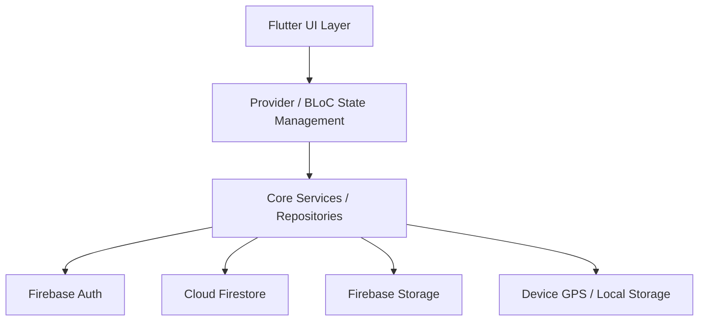
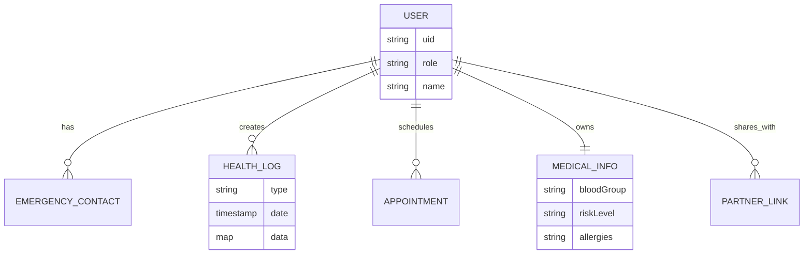
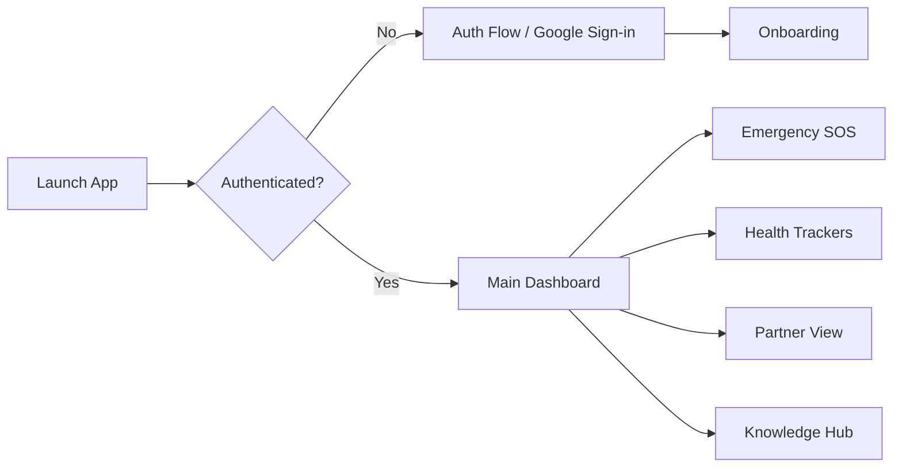

# MaatriCare / PregaCare - Complete Project Documentation

## 1. Executive Summary
- **Problem being solved:** The maternal healthcare journey is often fragmented, leaving expectant mothers overwhelmed by scattered medical records, delayed emergency responses, and a lack of integrated emotional and partner support.
- **Target users:** Expectant mothers, their partners, and maternal healthcare providers.
- **Why this problem matters:** Timely intervention, continuous monitoring, and emotional support are critical to reducing maternal and infant mortality rates and ensuring a healthy pregnancy journey.
- **High-level solution overview:** MaatriCare is an intelligent, unified maternal healthcare companion app built with Flutter and Firebase. It provides real-time health tracking, a robust emergency SOS system with live GPS sharing, a shared partner experience, and a curated knowledge hub.

## 2. Problem Statement
- **Existing challenges:** Pregnant women have to juggle multiple apps for tracking baby growth, logging medications, storing medical records, and contacting emergency services.
- **Limitations of current solutions:** Most apps are either purely informational or just simple trackers. They lack integrated emergency handling (accidental-tap prevented SOS), robust partner integration, and secure, centralized medical document storage.
- **Real-world impact:** Misplaced medical records or a delayed emergency response can lead to severe health complications. MaatriCare mitigates these risks by putting all critical tools in one unified, accessible platform.

## 3. Solution Overview
- **How the system works:** The app operates on a cross-platform mobile frontend (Flutter) backed by a real-time cloud database (Firebase Firestore). State is managed locally using the `Provider` and `flutter_bloc` patterns.
- **Key components:** 
  - Authentication & Onboarding
  - Emergency & Safety Module (SOS, Nearby Hospitals)
  - Tracker Module (Vitals, Mood, Baby Monitoring)
  - Shared Partner Journey Module
  - Knowledge Hub & Education
- **End-to-end workflow:** Users sign up, complete an onboarding profile, and access a comprehensive dashboard. From there, they can log daily vitals, share their journey with a partner via a secure connection, and access instant emergency tools.

## 4. Unique Selling Proposition (USP)
- **Accidental-Tap Prevented SOS System:** 
  - *What makes it different:* Uses a 2-second hold gesture with a radial animation to prevent accidental emergency triggers, revealing a bottom sheet with live GPS sharing and 108 ambulance dial.
  - *User benefits:* Prevents false alarms while ensuring help is just a deliberate touch away.
- **Shared Partner Journey:**
  - *What makes it different:* Specific role-based access for partners to view logs, emotional wellness, and emergency profiles without altering core medical data.
  - *Technical innovation:* Real-time Firestore listeners synced via a `PartnerProvider`.

## 5. Innovation Highlights
- **Glassmorphism & Soothing UI/UX:** 
  - *Technical novelty:* Custom-built `GlassCard` widgets utilizing backdrop filters to create a modern, calming aesthetic crucial for pregnant users.
- **Unified Health & Emotion Tracking:** 
  - *Practical usefulness:* Combines physical vitals tracking with mood logging, providing a holistic view of maternal health.
- **Scalability potential:** Built on Firebase Firestore, the NoSQL schema easily scales to millions of users with offline caching support.

## 6. Key Features
- **Emergency SOS & Live Location:** (Benefit: Instant safety; Tech: Geolocator, URL Launcher, custom hold-gesture animations).
- **Medication & Health Tracking:** (Benefit: Medication adherence; Tech: Local Notifications, Firestore).
- **Baby Monitoring:** (Benefit: Reassurance and progress tracking).
- **Records & Documents Vault:** (Benefit: Instant access to lab reports; Tech: Firebase Storage, File Picker).
- **Educational Community Hub:** (Benefit: Curated knowledge; Tech: Cached Network Images, Shimmer loading).

## 7. System Architecture

### Component Diagram & Data Flow
The architecture follows a modular, feature-first approach. The UI layer communicates with Providers, which interact with Firebase Services.

- **Frontend:** Flutter widgets organized by features (e.g., `lib/features/emergency`, `lib/features/tracker`).
- **Backend:** Firebase handles identity, real-time database, and asset storage.
- **Data Flow:** User action -> Provider update -> Firestore sync -> Listener broadcasts update to UI.

## 8. Technical Stack
- **Frontend:** Flutter, Dart, GoRouter, Google Fonts, FL Chart
- **Backend & Database:** Firebase Auth, Cloud Firestore, Firebase Storage
- **State Management:** Provider, flutter_bloc, Equatable
- **Hardware/APIs:** Geolocator, URL Launcher, Share Plus, Image Picker, File Picker
- **DevOps/Tools:** Flutter Lints, Firebase CLI

## 9. Database Design

- **Collections:** `users`, `emergency_contacts`, `health_logs`, `appointments`, `medical_profiles`.
- **Data flow:** Real-time listeners on the user's document and sub-collections keep the app state synchronized across devices (e.g., syncing between mother and partner).

## 10. Application Workflow

## 11. Security Measures
- **Authentication:** Firebase Authentication ensures secure login.
- **Authorization:** Firestore Security Rules (`firestore.rules`) strictly limit data read/writes to the document owner and authorized partners.
- **Data Protection:** Medical records and images uploaded via Firebase Storage are secured behind signed URLs/authenticated access.

## 12. Scalability Analysis
- **Current scalability:** The serverless Firebase architecture auto-scales based on traffic. Local state management minimizes redundant database reads.
- **Future improvements:** Implementing Firebase App Check to prevent abuse, and migrating heavy analytical queries to BigQuery if data volume grows exponentially.

## 13. Performance Optimizations
- **Existing optimizations:** 
  - `ChangeNotifierProxyProvider` is used to efficiently cascade user state to feature-specific providers.
  - Image caching via `cached_network_image`.
  - Pagination/lazy loading on lists (e.g., knowledge hub).

## 14. Challenges Faced and Solutions
- **Accidental SOS Triggers:** Mobile apps often suffer from accidental button presses. *Solution:* Implemented a 2-second gesture-hold mechanism with a visual radial progress bar to ensure intent.
- **Partner Data Syncing:** Keeping partner devices updated in real-time without excessive reads. *Solution:* Utilized Firestore real-time snapshot listeners scoped strictly to the linked user's data.

## 15. Impact Analysis
- **User impact:** Empowers expectant mothers with control, knowledge, and safety.
- **Social impact:** Reduces maternal anxiety and facilitates partner inclusion in the pregnancy journey.

## 16. Future Scope
- **Wearable Integration:** Syncing smartwatch vitals (heart rate, sleep) directly into the Tracker.
- **AI Health Insights:** Using Gemini API to provide personalized health tips based on logged symptoms and moods.
- **Telemedicine:** In-app video consultations with registered OB-GYNs.

## 17. Competitive Advantage
Unlike traditional period/pregnancy trackers (e.g., Flo, What to Expect) that focus heavily on content, **MaatriCare** uniquely blends actionable medical utility (document vault, robust SOS system) with partner integration and soothing, modern Glassmorphism UI.

## 18. Hackathon Judging Perspective
- **Innovation:** The gesture-based SOS and real-time partner syncing demonstrate strong product thinking.
- **Technical complexity:** Handling live GPS, complex state proxies (`ChangeNotifierProxyProvider`), and multiple hardware permissions seamlessly.
- **Feasibility:** Fully functional Flutter + Firebase implementation ready for deployment.
- **Real-world impact:** Directly addresses maternal safety and health tracking, a globally critical issue.

## 19. Installation and Setup Guide
### Prerequisites
- Flutter SDK (^3.10.4)
- Firebase Project configured for Android/iOS/Web

### Setup Steps
1. Clone the repository.
2. Run `flutter pub get` in the root directory.
3. Ensure `google-services.json` (Android) and `GoogleService-Info.plist` (iOS) are placed in their respective directories if not using `firebase_options.dart`.
4. Run `flutter run -d chrome` (for web) or select an emulator to test the application.

## 20. Conclusion
MaatriCare is not just an application; it is a holistic, intelligent platform designed to safeguard and support the maternal journey. By bridging the gap between medical tracking, emergency readiness, and emotional support, it stands out as a highly impactful and technically robust hackathon project.
